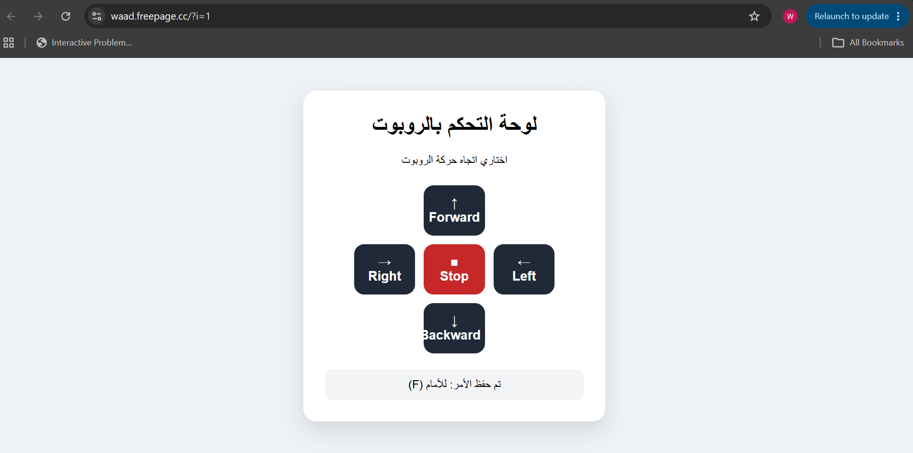
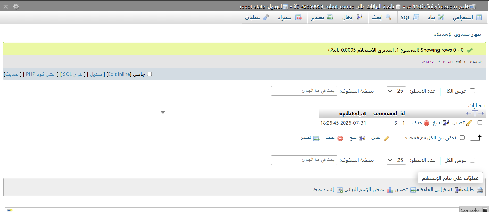
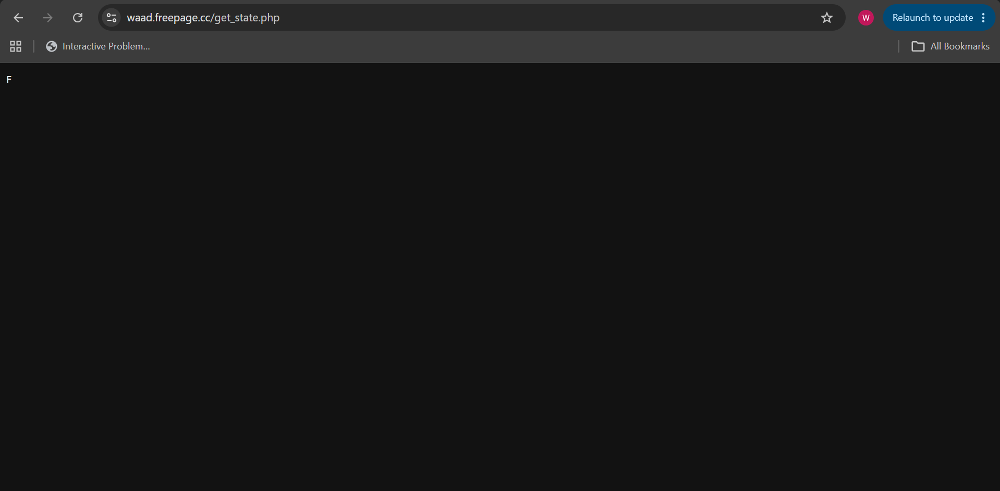
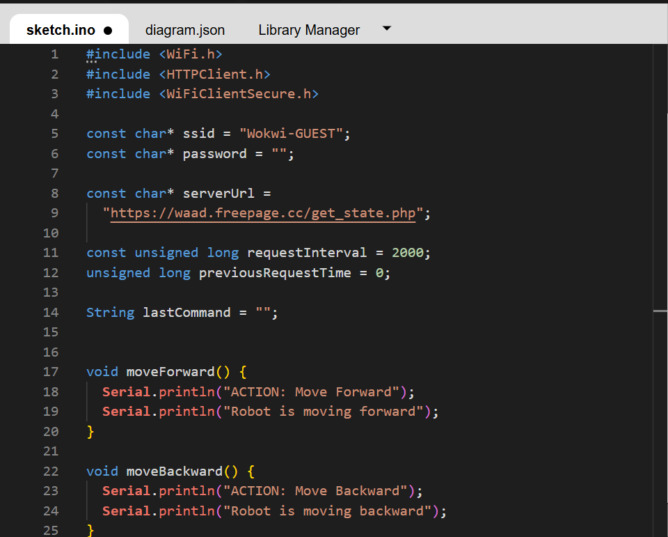
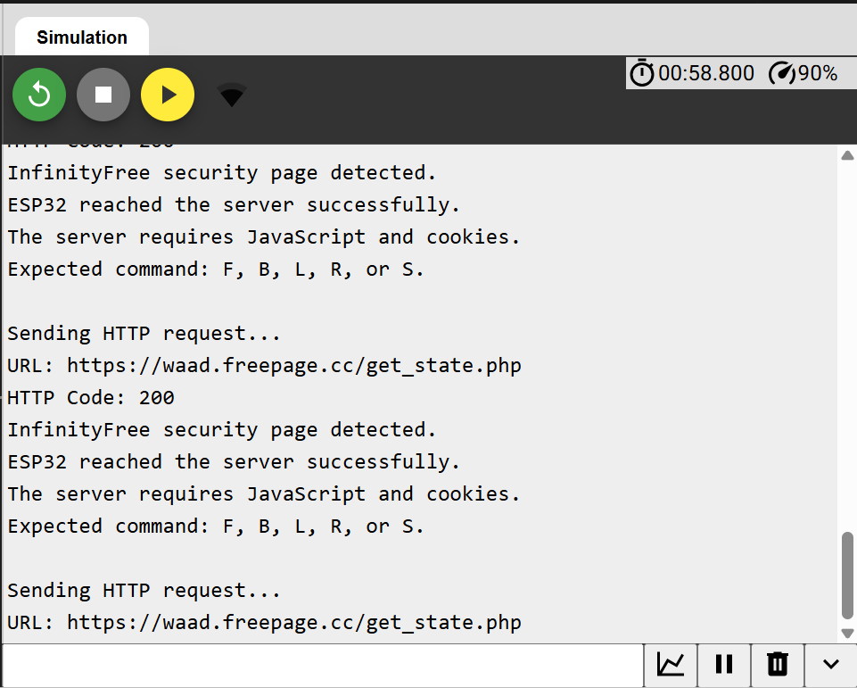

# 🤖 ESP32 Robot Control System

## Web-Based Robot Movement Control Using PHP, MySQL, HTTP, and Wokwi

A web-based robot control system that allows users to send movement commands through an interactive control panel. The selected command is stored in a MySQL database using PHP, and an ESP32 retrieves the latest command through an HTTP request.

---

## 📌 Project Overview

This project demonstrates how a web application can communicate with an ESP32 through a database and HTTP protocol.

The user selects a movement direction from the web control panel. JavaScript sends the selected command to a PHP file, which stores it in a MySQL database. The ESP32 then sends an HTTP request to another PHP endpoint to retrieve the latest command.

### System Workflow

```text
User
  ↓
Web Control Panel
  ↓
JavaScript Request
  ↓
update_command.php
  ↓
MySQL Database
  ↓
get_state.php
  ↓
ESP32 HTTP Request
  ↓
Robot Movement Command
```

---

## ✅ Project Status

| Component | Status |
|---|:---:|
| Web control panel | ✅ Completed |
| PHP and MySQL connection | ✅ Completed |
| Saving commands in the database | ✅ Completed |
| Retrieving commands using `get_state.php` | ✅ Completed |
| ESP32 Wi-Fi connection | ✅ Completed |
| ESP32 HTTP request | ✅ Completed |
| Direct ESP32 command retrieval from InfinityFree | ⚠️ Restricted by hosting security |

> The website, PHP files, and database work correctly.  
> The ESP32 also connects to Wi-Fi and reaches the hosting server successfully. However, InfinityFree returns a JavaScript security page instead of the plain-text command when the request comes from ESP32.

---

## ✨ Features

- Interactive robot control panel
- Forward movement command
- Backward movement command
- Left movement command
- Right movement command
- Stop command
- Responsive web interface
- PHP backend
- MySQL database integration
- Command validation
- ESP32 Wi-Fi connection
- HTTP GET requests
- Wokwi ESP32 simulation
- Safe default Stop command
- Clear Serial Monitor output

---

## 🎮 Robot Commands

| Command | Movement | Description |
|:---:|---|---|
| `F` | Forward | Move the robot forward |
| `B` | Backward | Move the robot backward |
| `L` | Left | Turn the robot left |
| `R` | Right | Turn the robot right |
| `S` | Stop | Stop the robot |

The database contains one main row:

```text
id = 1
```

The value of the `command` column changes whenever the user presses one of the control buttons.

---

## 🛠️ Technologies Used

| Category | Technology |
|---|---|
| Frontend | HTML5, CSS3, JavaScript |
| Backend | PHP |
| Database | MySQL |
| Database Management | phpMyAdmin |
| Microcontroller | ESP32 |
| ESP32 Programming | C++ / Arduino |
| Communication | HTTP Protocol |
| Simulation | Wokwi |
| Hosting | InfinityFree |
| Version Control | GitHub |

---

## 📁 Project Structure

```text
robot-control-task/
│
├── index.html
├── style.css
├── script.js
│
├── db.php
├── update_command.php
├── get_state.php
│
├── setup.sql
├── sketch.ino
├── README.md
│
├── control-panel.png
├── database-table.png
├── get-state-result.png
├── esp32-code.png
└── serial-monitor.png
```

---

## 📄 File Descriptions

### `index.html`

Contains the main structure of the robot control panel.

### `style.css`

Contains the visual design, button layout, colors, and responsive styling.

### `script.js`

Sends movement commands from the control panel to the PHP backend.

### `db.php`

Creates the connection between PHP and the MySQL database.

### `update_command.php`

Receives a command from the control panel and saves it in the database.

### `get_state.php`

Retrieves the latest command from the database and returns one plain-text character:

```text
F
B
L
R
S
```

### `setup.sql`

Creates the `robot_state` table and inserts the initial Stop command.

### `sketch.ino`

Contains the ESP32 code used to:

- Connect to Wi-Fi
- Send an HTTP GET request
- Read the server response
- Validate the returned command
- Execute the corresponding movement function
- Display the test result in Serial Monitor

---

# 🗄️ Database Setup

## Step 1: Create the Database

A MySQL database was created through the InfinityFree control panel.

Database name used in this project:

```text
if0_42550058_robot_control_db
```

InfinityFree automatically adds the hosting account prefix to the database name.

---

## Step 2: Import the SQL File

1. Open the InfinityFree control panel.
2. Go to **MySQL Databases**.
3. Open **phpMyAdmin**.
4. Select the project database.
5. Open the **Import** tab.
6. Select the `setup.sql` file.
7. Click **Import** or **Go**.

The SQL file creates the following table:

```sql
CREATE TABLE IF NOT EXISTS robot_state (
    id INT NOT NULL,
    command CHAR(1) NOT NULL DEFAULT 'S',
    updated_at TIMESTAMP NOT NULL
        DEFAULT CURRENT_TIMESTAMP
        ON UPDATE CURRENT_TIMESTAMP,
    PRIMARY KEY (id)
);
```

It also inserts the initial row:

```sql
INSERT INTO robot_state (id, command)
VALUES (1, 'S');
```

### Expected Table

| id | command | updated_at |
|---:|:---:|---|
| 1 | S | Current timestamp |

The value `S` is used as the safe default command because it represents Stop.

---

# 🔌 Database Connection

The database connection is configured inside `db.php`.

```php
<?php

$host = "YOUR_MYSQL_HOSTNAME";
$user = "YOUR_MYSQL_USERNAME";
$pass = "YOUR_MYSQL_PASSWORD";
$dbname = "YOUR_DATABASE_NAME";

$conn = new mysqli($host, $user, $pass, $dbname);

if ($conn->connect_error) {
    die("Database connection failed.");
}

$conn->set_charset("utf8mb4");
?>
```

## Security Notice

The real MySQL password must not be published in a public GitHub repository.

Before uploading `db.php` to GitHub, replace the real password with:

```php
$pass = "YOUR_MYSQL_PASSWORD";
```

The password should only be added to the version uploaded privately to the hosting server.

---

# 🌐 Website Deployment

The following files were uploaded to the InfinityFree `htdocs` directory:

```text
htdocs/
├── index.html
├── style.css
├── script.js
├── db.php
├── update_command.php
└── get_state.php
```

The following files are not required inside `htdocs`:

```text
setup.sql
sketch.ino
README.md
screenshots/
```

- `setup.sql` is imported using phpMyAdmin.
- `sketch.ino` is used inside Wokwi.
- `README.md` and the screenshots are used for GitHub documentation.

---

## 🔗 Project Links

### Live Control Panel

```text
https://waad.freepage.cc
```

### PHP Command Endpoint

```text
https://waad.freepage.cc/get_state.php
```

### Wokwi Simulation

```text
https://wokwi.com/projects/393020133767191553
```

---

# 🧪 Testing the Web Control Panel

The control panel provides five movement buttons:

- Forward
- Backward
- Left
- Right
- Stop

When the Forward button is pressed, JavaScript sends the following command:

```text
F
```

The website then displays a confirmation message:

```text
تم حفظ الأمر: للأمام (F)
```

This confirms that the frontend successfully sent the command to `update_command.php`.

---

# 🧪 Testing the Database

After pressing the Forward button, the database was checked using phpMyAdmin.

The following query can also be used:

```sql
SELECT * FROM robot_state;
```

The expected result is:

| id | command |
|---:|:---:|
| 1 | F |

This confirms that `update_command.php` successfully updated the database.

---

# 🧪 Testing the PHP Endpoint

The command endpoint was opened using:

```text
https://waad.freepage.cc/get_state.php
```

The page returned:

```text
F
```

This confirms that:

- PHP connected successfully to MySQL.
- The command was stored correctly.
- `get_state.php` retrieved the latest command.
- The endpoint returned the command as plain text.

---

# 📡 ESP32 and Wokwi Setup

The ESP32 connects to the default Wokwi Wi-Fi network:

```cpp
const char* ssid = "Wokwi-GUEST";
const char* password = "";
```

The project endpoint is defined as:

```cpp
const char* serverUrl =
  "https://waad.freepage.cc/get_state.php";
```

The ESP32 sends an HTTP GET request every two seconds.

```cpp
int httpCode = http.GET();
String response = http.getString();

response.trim();
response.toUpperCase();
```

The command is then checked and passed to the correct movement function:

```cpp
if (response == "F") {
    moveForward();
}
else if (response == "B") {
    moveBackward();
}
else if (response == "L") {
    turnLeft();
}
else if (response == "R") {
    turnRight();
}
else if (response == "S") {
    stopRobot();
}
```

---

# 📟 ESP32 Test Result

The ESP32 successfully connected to Wi-Fi.

The Serial Monitor displayed:

```text
================================
ESP32 Robot Control
================================

Connecting to WiFi......
WiFi Connected!
IP Address: 10.10.0.2

Sending HTTP request...
URL: https://waad.freepage.cc/get_state.php
HTTP Code: 200
```

This confirms that:

- ESP32 connected to the Wokwi Wi-Fi network.
- ESP32 sent an HTTP GET request.
- The request reached the hosting server.
- The server responded with HTTP status code `200`.

---

# ⚠️ InfinityFree Security Limitation

During ESP32 testing, InfinityFree returned a browser-security page instead of the expected plain-text command.

The Serial Monitor displayed:

```text
InfinityFree security page detected.
ESP32 reached the server successfully.
The server requires JavaScript and cookies.
Expected command: F, B, L, R, or S.
```

The InfinityFree free hosting security system requires JavaScript and browser cookies. A browser can complete this security process, but ESP32 cannot execute JavaScript.

As a result:

- The endpoint returns the correct command when opened in a browser.
- ESP32 reaches the hosting server successfully.
- The server returns HTTP status code `200`.
- InfinityFree replaces the command with its JavaScript security page.

This is a hosting limitation and not an error in the Wi-Fi connection, PHP files, database, or HTTP request code.

---

# 📸 Project Screenshots

## 1. Robot Control Panel

The following screenshot shows the control panel after saving the Forward command:



---

## 2. MySQL Database Table

The following screenshot shows the `robot_state` table in phpMyAdmin:



---

## 3. PHP Endpoint Result

The following screenshot shows `get_state.php` returning the command `F`:



---

## 4. ESP32 Code

The following screenshot shows the ESP32 code with the project endpoint:



---

## 5. Serial Monitor Result

The following screenshot shows the Wi-Fi connection and HTTP request result:



---

# ▶️ How to Run the Project

## Run the Website

1. Create a MySQL database in InfinityFree.
2. Open phpMyAdmin.
3. Import `setup.sql`.
4. Add the correct database information to `db.php`.
5. Upload the website and PHP files to `htdocs`.
6. Open the live website.
7. Press one of the movement buttons.
8. Check the value in the `robot_state` table.
9. Open `get_state.php` to confirm the returned command.

## Run the ESP32 Simulation

1. Open the Wokwi project.
2. Open `sketch.ino`.
3. Confirm that the correct endpoint is used.
4. Start the simulation.
5. Open Serial Monitor.
6. Confirm the Wi-Fi connection.
7. Confirm the HTTP response code.
8. Review the returned server response.

---

# 🎯 Project Results

The project successfully achieved the following objectives:

- Designed an interactive robot control panel.
- Created five robot movement commands.
- Connected PHP to a MySQL database.
- Stored movement commands in the database.
- Retrieved the latest command through a PHP endpoint.
- Connected ESP32 to Wi-Fi using Wokwi.
- Sent an HTTP request from ESP32 to the hosting server.
- Received an HTTP `200` response from the server.
- Identified and documented the InfinityFree security limitation.

---

# 🚀 Future Improvements

Possible future improvements include:

- Moving the API to a hosting platform that supports ESP32 requests.
- Connecting real motors and a motor driver to the ESP32.
- Adding live robot status to the control panel.
- Adding voice-control commands.
- Adding authentication for the control panel.
- Recording command history in the database.
- Displaying the last update time on the website.
- Using HTTPS with a compatible API hosting service.

---

# 🔒 Security

- Database passwords must not be published on GitHub.
- Input commands are validated before being stored.
- Only the commands `F`, `B`, `L`, `R`, and `S` are accepted.
- The default safe action is Stop.
- Sensitive hosting credentials are excluded from the public repository.

---

# 📝 Conclusion

The **ESP32 Robot Control System** successfully demonstrates communication between a web interface, PHP backend, MySQL database, and ESP32.

The web control panel successfully saves robot movement commands in the database, while `get_state.php` retrieves and displays the latest command correctly.

The ESP32 successfully connects to Wi-Fi and reaches the hosting server through an HTTP request. InfinityFree returns a JavaScript verification page to ESP32 because of its free-hosting security restrictions, but all main project components and communication steps were implemented and tested successfully.

---

## 👩‍💻 Author

**Waad Alfuraidi**  
Computer Science Student  
Qassim University